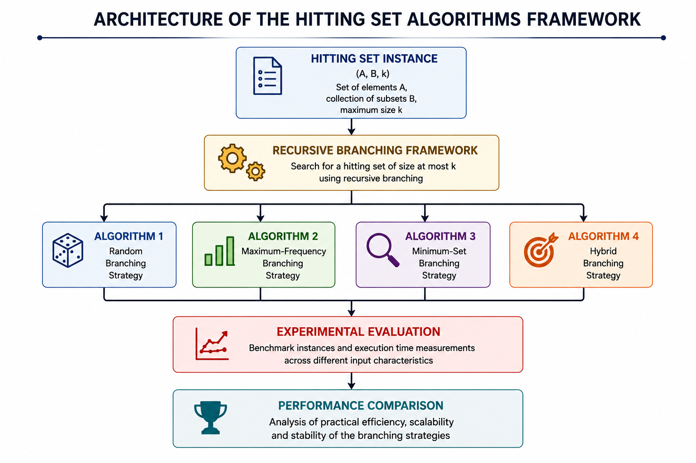
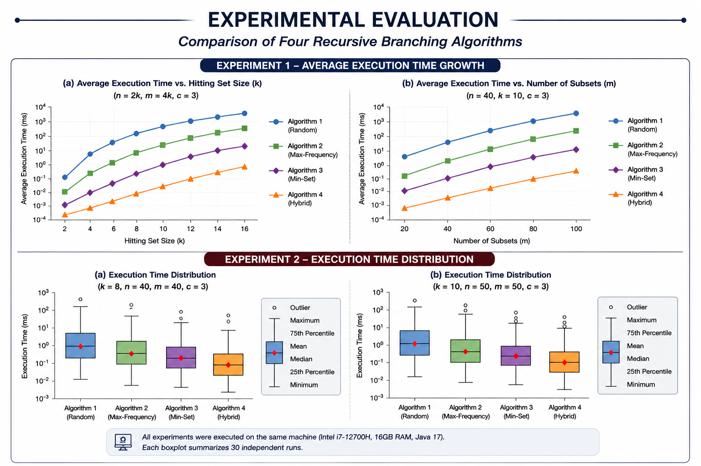

<div align="center">


\# Hitting Set Algorithms in Java


\### Recursive branching algorithms for the NP-complete Hitting Set problem


\*\*Java • Algorithms • Computational Complexity • Recursion\*\*


</div>


<p align="center">

&#x20; 

</p>


\---


\## Overview


This repository presents four recursive branching algorithms for solving the \*\*Hitting Set\*\* problem, a classical \*\*NP-complete\*\* combinatorial optimization problem.


The repository investigates different branching strategies for constructing hitting sets and experimentally compares their practical performance on carefully designed benchmark instances.


Besides the algorithm implementations, the repository includes randomized instance generators, experimental datasets, performance measurements, and a detailed experimental evaluation that analyzes the behavior of each branching strategy under different input characteristics.


The repository is intended for educational and experimental purposes, providing a practical framework for studying exact recursive algorithms and branching heuristics for NP-complete problems.


\---


\## Why Hitting Set?


The \*\*Hitting Set\*\* problem is one of the fundamental combinatorial optimization problems in theoretical computer science. Given a collection of sets, the objective is to determine the smallest subset of elements that intersects every set in the collection.


Hitting Set is \*\*NP-complete\*\* and has deep connections with approximation algorithms, parameterized complexity, exact exponential algorithms, and combinatorial optimization. It also appears in numerous practical applications, including test case generation, resource allocation, network monitoring, and computational biology.


For this reason, Hitting Set serves as a classical benchmark for studying branching strategies and evaluating exact recursive algorithms.


\---


\## Problem Definition


Given a finite set \*\*A\*\* together with a collection of subsets


\*\*B = {B₁, B₂, ..., Bₘ}\*\*,


the goal is to determine whether there exists a subset


\*\*H ⊆ A\*\*


of size at most \*\*k\*\* such that every subset \*\*Bᵢ\*\* contains at least one element of \*\*H\*\*.


In other words, every subset must be "hit" by at least one selected element.


The objective is to determine whether a hitting set of size at most k exists and, if so, construct one.


The project focuses on exact recursive algorithms for solving the decision version of the problem and experimentally compares different branching heuristics.


\---


\## Features


\- Four recursive branching algorithms for the Hitting Set problem

\- Multiple branching heuristics

\- Exact exponential search algorithms

\- Random instance generators

\- Experimental benchmark datasets

\- Performance comparison of branching strategies

\- Worst-case complexity discussion

\- Experimental evaluation with real execution times

\- Clean object-oriented Java implementation

\- Recursive backtracking framework

\- Benchmark instance generators


\---


\## Implemented Algorithms


The repository implements four recursive branching algorithms based on different decision heuristics.


\### Random Branching Strategy


Randomly selects candidate elements during the recursive branching process.


\### Maximum-Frequency Branching


Selects the element that appears in the largest number of remaining subsets.


\### Minimum-Set Branching


Branches using the smallest remaining subset, reducing the branching factor whenever possible.


\### Hybrid Branching Strategy


Combines the minimum-set heuristic with maximum-frequency selection in order to exploit the advantages of both approaches.


\---


\## Branching Strategies


The practical performance of exact recursive algorithms for the Hitting Set problem is heavily influenced by the branching decisions performed during the search process.


Although all implemented algorithms solve the same decision problem exactly, they differ in the heuristic used to select branching candidates. Different branching strategies may significantly reduce or increase the size of the explored search tree depending on the characteristics of the input instance.


The repository experimentally evaluates four branching strategies in order to investigate how heuristic decisions affect practical performance.


\---


\## Complexity Analysis


Let


\- \*\*m\*\* = number of subsets

\- \*\*n\*\* = number of elements

\- \*\*k\*\* = maximum allowed hitting set size

\- \*\*c\*\* = maximum subset size (constant)


The implemented algorithms are exact recursive branching algorithms.


Under the assumption that the maximum subset size is bounded by the constant \*\*c\*\*, the worst-case running time is


\*\*O(kᶜ · m)\*\*


while the recursion depth is bounded by \*\*k\*\*.


Although all algorithms share the same theoretical worst-case complexity, their practical performance differs considerably due to the branching heuristic employed during recursion.


The experimental study investigates how different branching heuristics influence the practical search-tree size despite identical asymptotic worst-case bounds.


\---


\## Experimental Methodology


The implemented algorithms were experimentally evaluated on randomly generated Hitting Set instances.


Two independent experiments were conducted.


\- \*\*Experiment 1\*\* investigates the maximum problem size that each algorithm can solve within a practical execution time.


\- \*\*Experiment 2\*\* compares the execution time required to compute an existing hitting set using multiple independent executions for each branching strategy.


Random instance generators were developed specifically for both experiments in order to evaluate the algorithms under different structural characteristics of the input instances.


\---


\## Experimental Evaluation


The experimental evaluation consists of two complementary experiments. The first analyzes how execution time scales with increasing problem size, while the second examines the distribution and stability of execution times across multiple independent executions. Together, the results demonstrate the practical impact of different branching heuristics despite identical theoretical worst-case complexity.


<p align="center">

&#x20; 

</p>


<p align="center">

&#x20; <em>Figure 1. Experimental evaluation of the four recursive branching algorithms.</em>

</p>


Overall, the experimental results indicate that the choice of branching heuristic has a substantial impact on practical performance, even though all implemented algorithms share the same asymptotic worst-case complexity.


\---


\## Project Structure


```text

hitting-set-algorithms-java/

│

├── src/

│   └── algorithms/

│       └── hittingset/

│           ├── HittingSetAlgorithms.java

│           ├── RandomInstanceGenerator.java

│           ├── ExperimentOneGenerator.java

│           └── ExperimentTwoGenerator.java

│

├── datasets/

│   ├── experiment1.dat

│   ├── experiment2.dat

│   ├── outputExperiment1.txt

│   ├── outputExperiment2.txt

│   └── sets.dat

│

├── report/

│   ├── Report\_PartA.pdf

│   ├── Report\_PartB.pdf

│   └── ExperimentalResults.xlsx

│

├── images/

│   ├── architecture.png

│   ├── experimental-results.png

│

├── README.md

├── LICENSE

└── .gitignore

```


\---


\## Running the Project


\### Requirements


\- Java 17 or later


The project can be compiled and executed directly from the command line.


\### Compile


```bash

javac src/algorithms/hittingset/\*.java

```


\### Generate Input Instances (Optional)


Generate the datasets used in the experimental evaluation.


\*\*Random benchmark instances\*\*


```bash

java -cp src algorithms.hittingset.RandomInstanceGenerator

```


\*\*Experiment 1 datasets\*\*


```bash

java -cp src algorithms.hittingset.ExperimentOneGenerator

```


\*\*Experiment 2 datasets\*\*


```bash

java -cp src algorithms.hittingset.ExperimentTwoGenerator

```


The generated files are stored in the `datasets/` directory.


\### Run the Interactive Application


```bash

java -cp src algorithms.hittingset.HittingSetAlgorithms

```


The application provides an interactive menu that allows the user to:


\- solve Hitting Set instances,

\- execute the implemented branching algorithms,

\- reproduce the experimental evaluation,

\- generate output files inside the `datasets/` directory.


> \*\*Note\*\*

>

> The repository already includes the datasets used in the experiments. Running the dataset generators is only necessary to create new random benchmark instances.


\---


\## Future Improvements


Possible future extensions include:


\- Parameterized algorithms

\- Kernelization techniques

\- Additional branching heuristics

\- Parallel search strategies

\- Benchmark suite with larger instances

\- Approximation algorithms

\- Visualization of recursion trees

\- JUnit test suite


\---


\## References


\- Richard M. Karp, \*Reducibility Among Combinatorial Problems\*, 1972.

\- Vijay V. Vazirani, \*Approximation Algorithms\*, Springer.

\- Rod G. Downey and Michael R. Fellows, \*Parameterized Complexity\*, Springer.

\- Marek Cygan et al., \*Parameterized Algorithms\*, Springer.


\---


\## License


This project is licensed under the \*\*MIT License\*\*.


\---


<div align="center">


Maintained by \*\*Anastasis Zachariou\*\*


</div>


